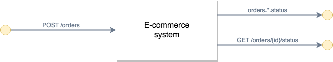

# E-Commerce example (External)

This example aims to demo how an external-facing e-commerce API would look like in AsyncAPI 2.0.

The [asyncapi.yml](./asyncapi.yml) file represents the following diagram:

> Notice that `GET /orders/{id}/status` is an HTTP streaming endpoint. Check out the http bindings definition for the `orderStatus` message.