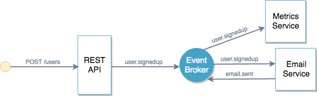

# Signup (Internal and External)

This example aims to demo how an internal user management API would look like in AsyncAPI 2.0.

The architecture looks like the following diagram:

The [signup.yml](./signup.yml) file has the internal operations of the REST API, i.e., publishing to the `user.signedup` AMQP topic.

The [signup-external.yml](./signup-external.yml) file has the external operations of the REST API, i.e., `POST`ing to the `/users` endpoint. This API could have been included in the signup.yml file too but was separated for clarity. This way, the file can be shared with 3rd-parties without them having to know anything about internal operations.

The [signup-metrics.yml](./signup-metrics.yml) file has the internal operations of the Metrics Service. This service only subscribes to the `user.signedup` topic.

The [signup-email.yml](./signup-email.yml) file has the internal operations of the Email Service. This service subscribes to the `user.signedup` topic to send welcome emails to users. Once the email has been sent, it publishes a new event to the `email.sent` topic.